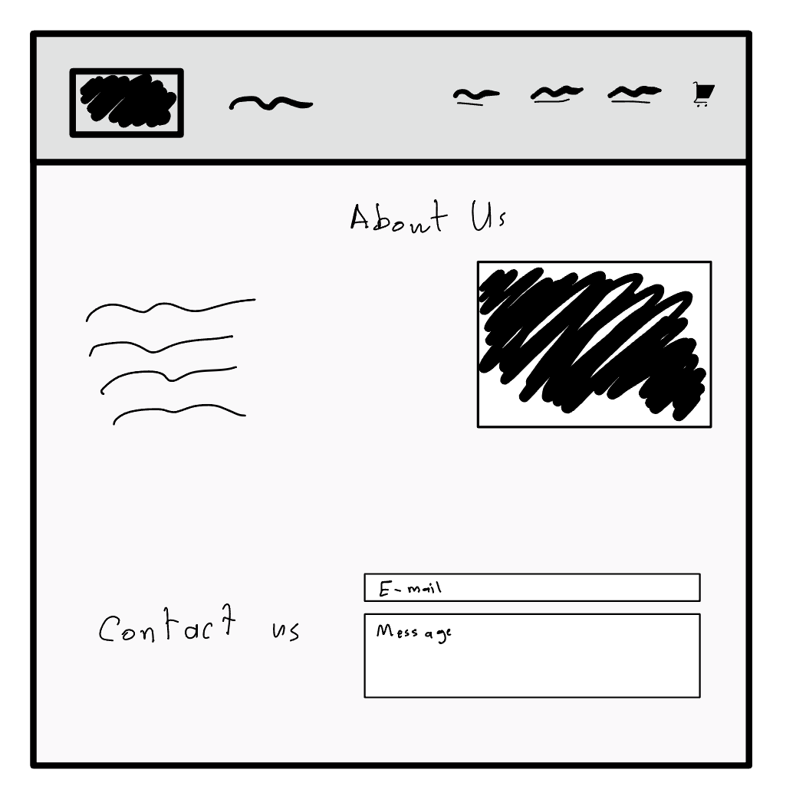
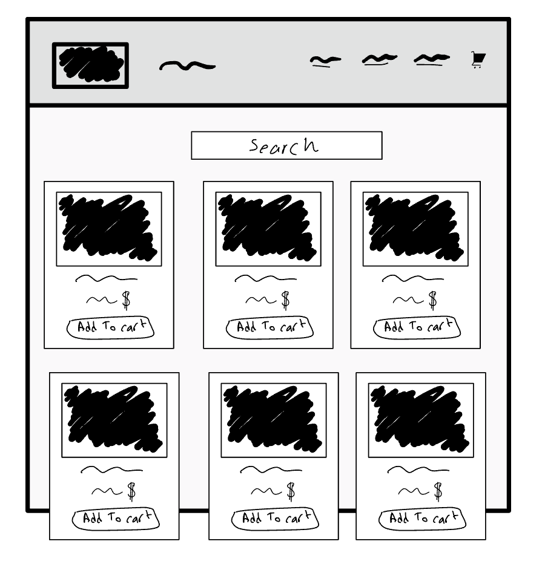
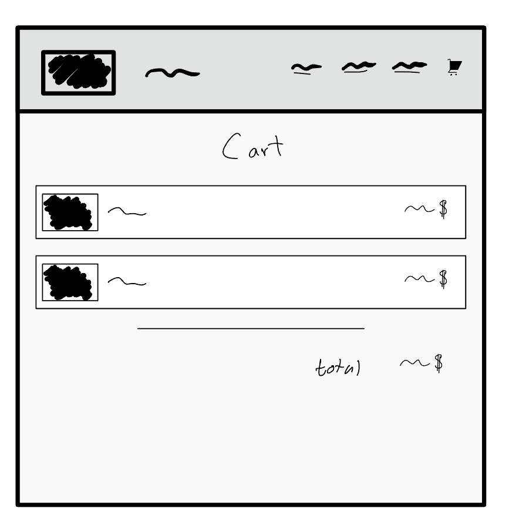

 

  <h1>مشروع الطلبة المتميزين 🦸🏻‍♀️🦸🏻‍♂️ 😍 </h1>
  <h3>في هذا المشروع ستقوم بصنع موقع E-commerce (المنتجات من اختيارك 😍 ورونا ابداعكم)</h3>
  
الصفحة الرئيسية 🏡:
1. شريط التنقل 
    - قم بإضافة في شريط التنقل :
      * اسم الموقع
      * اضف شعار الموقع
      * رابط ينقلك الى صفحة "المنتجات"
      * رابط ينقلك إلى قسم "about us"
      * رابط ينقلك إلى قسم "contact us"
      * اضف أيقونة سلة المشتريات (تنقلك إلى صفحة السلة)
2. قسم  "about us"
3. قسم "contact us"
  
  <h1></h1>
صفحة  المنتجات 🧥:
  
1. شريط التنقل (نفس شريط التنقل الموجود في الصفحة الرئيسية)
2. أضف حقل بحث فوق المنتجات
3. اضف المنتجات  (اقل شي ٣ منتجات)
    - لكل منتج:
      * الاسم
      * السعر
      * صورة
      * زر لإضافة المنتج  إلى السلة

جافاسكربت الصفحة:
1. المنتجات تُدرج عن طريق دالة forEach
2. استخدم ما تعلمناه لتشغيل محرك البحث
3. احفظ المنتج في المتصفح(localStorage) عند إضافة منتج

<h1></h1>
صفحة السلة 🛒:

1. شريط التنقل (نفس شريط التنقل الموجود في الصفحة الرئيسية)
2. ادرج المنتجات المضافة للسلة (مع زر حذف المنتج من السلة دون تفعيلة)
3. مجموع سعر المنتجات في السلة
 
جافاسكربت الصفحة:
1. ادرج المنتجات من المتصفح(localStorage)
2. احسب سعر المنتجات في السلة

## بونص!🔥

* قائمة منسدلة Dropdown menu (bootstrap)
* انميشن Animations
* أضف عداد عند ايقونة السلة في شريط التنقل  يحسب عدد المنتجات في قسم السلة
* قم بتفعيل زر إزالة المنتج من قسم السلة

